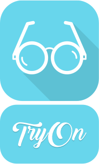

# TryOn

  
  
  

TryOn is built on top of an iOS implementation of [OpenFace](https://github.com/TadasBaltrusaitis/OpenFace) by [FaceAR](https://github.com/FaceAR/OpenFaceIOS).

## Requirements

* iOS 9.0
* Swift 3
* Xcode 8
